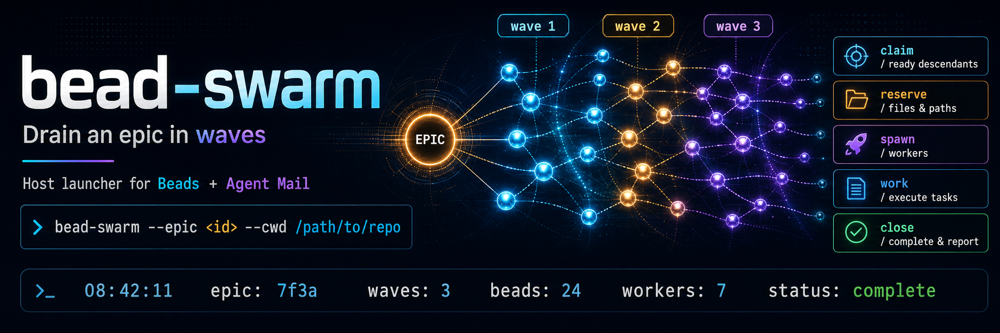

Host launcher that **builds an epic of Beads** in waves. The program is `bin/bead-swarm` (Python), with helpers in `beadswarm/`.

You point it at a repo that already has a `.beads` graph. It takes `--epic <id>`, claims ready descendants, leases files through Agent Mail, and recycles orchestrator waves until `bd ready` for that tree is empty and the epic can close.

This chat session is **not** the orchestrator. Exec the binary; it scans which of `claude` / `codex` / `grok` / `cursor-agent` are installed, walks `PLANNING_MODELS`, and spawns the harness that can actually run that model.

```
bin/bead-swarm --epic <id> --cwd /path/to/your/repo
```

## Prerequisites

Install these on the host. `bin/install --status` reports which ones it can see.

**Required to run `bin/bead-swarm`:**

| Binary | What it is | Link |
|--------|------------|------|
| `python3` | Python 3.11+ | [python.org](https://www.python.org/downloads/) |
| `git` | The target repo is a git checkout | [git-scm.com](https://git-scm.com/) |
| `bd` | Go [Beads](https://github.com/steveyegge/beads) — graph issue tracker (`bd ready`, `--claim`, `--json`) | [steveyegge/beads](https://github.com/steveyegge/beads) |
| `am` | [Agent Mail](https://github.com/Dicklesworthstone/mcp_agent_mail) CLI — identities and file reservations | [Dicklesworthstone/mcp_agent_mail](https://github.com/Dicklesworthstone/mcp_agent_mail) |

**Used by the launcher** (tests pin `BEAD_SWARM_BR_BIN` to Go `bd` because `br` on PATH is often a shim):

| Binary | What it is | Link |
|--------|------------|------|
| `br` | [Beads Rust](https://github.com/Dicklesworthstone/beads_rust) — Rust port of Beads; same graph, `br` CLI | [Dicklesworthstone/beads_rust](https://github.com/Dicklesworthstone/beads_rust) |
| `bv` | [Beads Viewer](https://github.com/Dicklesworthstone/beads_viewer) — TUI + robot-next. **Never run bare `bv`** (it opens a TUI). Workers call `bv-robot-next` / `bv --robot-next` only. | [Dicklesworthstone/beads_viewer](https://github.com/Dicklesworthstone/beads_viewer) |

**Live waves** also need at least one coding harness on `PATH`: `claude`, `codex`, `grok`, or `cursor-agent`. Every start prints `clis:` (which of those binaries exist), then walks `PLANNING_MODELS` and skips missing CLIs before probing quota. A quota-live winner is cached for an hour (`--reprobe` or `BEAD_SWARM_SEAT_CACHE_TTL=0` ignores it). `--lab` skips the harnesses and uses this repo's deterministic worker instead.

`--cwd` must contain `.beads`. The swarm checkout is **not** the beads project unless you pass it on purpose.

## Install

Do **not** copy `bin/bead-swarm` somewhere else. The lab worker imports `beadswarm` from this checkout; a copied bin will break. Use a shim that sets `BEAD_SWARM_HOME`, or call `./bin/bead-swarm`.

```bash
git clone https://github.com/rickgorman/bead-swarm.git
cd bead-swarm
bin/install --global          # shims in ~/.local/bin + user-level agent skills
hash -r
command -v bead-swarm
bin/install --status
```

Per-repo (this checkout, or a submodule): `bin/install --local` then `./bin/bead-swarm`. Undo global: `bin/install --uninstall`.

The skill (`.claude/skills/bead-swarm`, plus `.grok` / `.agents` links) tells an agent **when** to exec the binary and **not** to empty the graph in the live chat.

## Drain an epic

1. Target repo has `.beads` and an open epic (`bd list -t epic --status open`).
2. Preview, then run:

```bash
bead-swarm --dry-run --epic YOUR-EPIC-ID --cwd /path/to/repo
bead-swarm --epic YOUR-EPIC-ID --cwd /path/to/repo
```

TTY with no `--epic` prints open epics and waits for a pick. Non-TTY without `--epic` prints the list and exits 1.

3. Watch stdout: seat, ready count, `wave N: spawned`, then either `frontier dry` (exit 0, epic closed) or leftover ready/stuck beads (exit 1).

Useful knobs:

| Flag | Default | Meaning |
|------|---------|---------|
| `--cwd` | current directory | Beads + Agent Mail project |
| `--epic` | TTY picker | Epic whose descendants to empty |
| `--wave-size` | 10 | Beads per wave, then that orchestrator **exits** |
| `--max-waves` | 4 | Concurrent waves |
| `--stagger-seconds` | 30 | Delay between spawning waves |
| `--seat` | probe ladder | Pin `fable` / `sol` / `opus5` / `terra` / `grok` / `composer` |
| `--once` | off | One round of waves, no recycle |
| `--no-am` | off | Skip Agent Mail (including the launcher lock) |
| `--no-scavenge` | off | Do not close/requeue `in_progress` corpses when ready is empty |
| `--hung-after SEC` | off | Steal a live pid whose heartbeat is older than SEC |
| `--probe-only` | | Print the seat and exit |
| `--lab` | off | Deterministic worker (dummy graphs / tests), not an LLM |

Two host launchers on the same `--cwd` flock `tmp/bead-swarm/launcher.lock`; the second bounces.

## Environment

`BEAD_SWARM_*` wins when both a namespaced name and a short alias exist. Specs are `harness/model/effort` (`model` and `effort` optional). Harnesses: `claude`, `codex`, `grok`, `cursor` (alias `cursor-agent`).

```bash
# JSON array (recommended)
export PLANNING_MODELS='["claude/fable-5/xhigh","codex/gpt-5.6-sol/xhigh","claude/opus-5/xhigh"]'
export BUILDING_MODELS='["cursor/composer-2.5","grok","claude/opus-5/xhigh","codex/gpt-5.6-terra/high"]'

# Same thing, comma-separated
export PLANNING_MODELS=claude/fable-5/xhigh,codex/gpt-5.6-sol/xhigh,claude/opus-5/xhigh
```

Every launch prints the resolved ladders and CLI scan:

```
clis: claude=/opt/homebrew/bin/claude codex=missing grok=/opt/homebrew/bin/grok cursor=missing
planning: claude/fable-5/xhigh, codex/gpt-5.6-sol/xhigh, claude/opus-5/xhigh
building: cursor/composer-2.5, grok, claude/opus-5/xhigh
orchestrator: opus5 claude/opus-5/xhigh (fable quota_dead, sol bin_missing)
```

`PLANNING_MODELS` is the orchestrator fallback order (the host pings, then spawns). `BUILDING_MODELS` is injected into each wave prompt so the orchestrator picks **coders** from that list, skipping missing CLIs.

| Variable | Default | What it does |
|----------|---------|--------------|
| `PLANNING_MODELS` / `BEAD_SWARM_PLANNING_MODELS` | `claude/fable`, `codex/gpt-5.6-sol`, `claude/opus`, `codex/gpt-5.6-terra`, `grok`, `cursor/composer-2.5` | Orchestrator ladder |
| `BUILDING_MODELS` / `BEAD_SWARM_BUILDING_MODELS` | `cursor/composer-2.5`, `grok`, `claude/opus`, `codex/gpt-5.6-terra` | Coder fallback list in the wave prompt |
| `BEAD_SWARM_CLAUDE_BIN` | `claude` | Claude CLI path |
| `BEAD_SWARM_CODEX_BIN` | `codex` | Codex CLI path |
| `BEAD_SWARM_GROK_BIN` | `grok` | Grok CLI path |
| `BEAD_SWARM_CURSOR_BIN` | `cursor-agent` | Cursor CLI path |
| `BEAD_SWARM_BR_BIN` / `BR_BIN` | `br` | Beads CLI (tests pin this to Go `bd`) |
| `BEAD_SWARM_AM_BIN` / `AM_BIN` | `am` | Agent Mail CLI |
| `BEAD_SWARM_HOME` | this checkout | Where `bin/` and `beadswarm/` live |
| `BEAD_SWARM_SEAT_CACHE` | `~/.cache/flywheel/orchestrator-seat.json` | Quota-winner cache file |
| `BEAD_SWARM_SEAT_CACHE_TTL` | `3600` | Cache seconds; `0` = probe every start |
| `BEAD_SWARM_WAVE_SIZE` | `10` | Beads per wave (`--wave-size`) |
| `BEAD_SWARM_MAX_WAVES` | `4` | Concurrent waves (`--max-waves`) |
| `BEAD_SWARM_STAGGER` | `30` | Seconds between spawning waves |
| `BEAD_SWARM_PROBE_TIMEOUT` | `45` | Seat ping timeout |
| `BEAD_SWARM_PING_PROMPT` | `Reply with the single word pong.` | Probe prompt |
| `BEAD_SWARM_LAUNCHER_LOCK_TTL` | `21600` | Agent Mail TTL on `launcher.lock` (seconds) |
| `BEAD_SWARM_READY_LIMIT` | `200` | `bd ready --limit` |
| `BEAD_SWARM_WAIT_POLL` | `1` | Seconds between wave-process polls |
| `BEAD_SWARM_SCAVENGE_MAX_AGE` | `2` | Heartbeat freshness for scavenger |
| `BEAD_SWARM_RESERVE_SECONDS` | `45` | Lab worker AM-reserve retry budget |
| `BEAD_SWARM_SKIP_BV` | `1` | Lab worker skips `bv` unless `0` |
| `BEAD_SWARM_WAVE` | unset | Set on child waves; nest guard |
| `ASDF_RUBY_VERSION` | `4.0.1` | Passed through so `br` shims find Ruby |

Effort flags by harness: Claude/Grok `--effort xhigh`; Codex `-c model_reasoning_effort=xhigh`; Cursor `model[effort=xhigh]`.

## What a wave does

Each child process gets a hard budget of `--wave-size` ready ids (P0 first) and must print `WAVE_DONE` and exit. The host recycles until the epic's frontier is dry.

Inside a live wave the spawned orchestrator:

1. Claims only ids on its allowed list (`br update <id> --claim`)
2. Reserves files with `am` **before** writes; retries exclusive JSON `conflicts` and mailbox `temporarily busy`
3. Spawns a **fresh coder** per bead (the orchestrator writes zero product code)
4. Closes with evidence; the host wraps the epic when every child is closed

`--lab` replaces that harness with `bin/bead-swarm-lab-worker` (claim → reserve → write → release → close). Use it for dummy graphs, not for building your product.

If a worker dies mid-bead, the next recycle **scavenges** `in_progress` rows (complete file → close; incomplete + dead pid → unclaim). Live pids are left alone unless you pass `--hung-after`.

## Lab tests (optional)

Dummy graphs pressure-test overlap, claims, Agent Mail, wrap, and crash/hang recovery without touching a real project graph.

```bash
python3 -m unittest discover -s tests -v
```

One scenario, no unittest:

```bash
bin/bead-swarm-lab-setup --scenario 01-overlap-exclusive --dir /tmp/ovx --force
bin/bead-swarm --lab --seat grok --epic "$(cat /tmp/ovx/EPIC)" --cwd /tmp/ovx --wave-size 1 --max-waves 2 --stagger-seconds 0
```

### Scenario corpus

| # | Scenario | What it stresses |
|---|---|---|
| 00 | `width6` | 20 beads, max ready width 6, independent files. Wave recycle. |
| 01 | `overlap-exclusive` | Two ready beads exclusive-append the same file. Graph says parallel; AM serializes. |
| 02 | `touch-label` | `touch:files/hotspot.txt` with no `blocks` edge (the migrate-file convention). |
| 03 | `blocks-same-file` | Same file **with** a `blocks` edge. Ready width 1; no AM conflict. |
| 04 | `fan-in-merge` | Three parallel writers, then a merge bead blocked by all three. |
| 05 | `fan-out-shared` | Seed exclusive-writes; children take a **shared** lease on the seed. |
| 06 | `two-clusters` | Two disjoint chains in one epic. Parallel waves, one wrap. |
| 07 | `claim-race` | Two workers, one bead, `bd update --claim`. Exactly one writer. |
| 08 | `abandoned-ttl` | Claim + exclusive lease, then die. AM TTL expires; the bead stays `in_progress` until reopen. |
| 09 | `nway-log` | Six parallel exclusive appends to `files/log.txt`. No lost lines. |
| 10 | `nested-epics` | Program → two slices, cross-slice overlap, close-eligible inside-out. |
| 11 | `cycle-trap` | `bd` rejects A↔B. A stuck `in_progress` blocker leaves ready empty; swarm exits 1 and does not wrap. |
| 12 | `two-epics-leak` | Two programs in one db. `--epic A` must not claim or close B. |
| 13 | `partial-wrap` | Alpha slice done, beta still claimed. Only alpha closes. |
| 14 | `diamond` | A → B,C → D. Ready 1 then 2 then 1. |
| 15 | `partial-overlap` | A/B share one file; C is disjoint. |
| 16 | `shared-vs-exclusive` | Shared reader holds seed; exclusive writer waits. |
| 17 | `no-am-rmw` | Negative: two rmw-appends without AM lose an update. |
| 18 | `second-launcher` | Second process flocks `launcher.lock` and bounces. |
| 19 | `once-vs-recycle` | `--once` leaves layer 2; a second full run finishes. |
| 20 | `off-epic-bv` | Fake `bv` recommends a distractor; worker only claims the allowed id. |
| 21 | `foreign-actor` | OtherFox holds the claim. Swarm does not steal. |
| 22–30 | crash/hang | Finish-without-close, SIGKILL before/after write, live hang (with and without heartbeat), hang-then-succeed, two incomplete log beads, close-without-release, idempotent replay. |
| 31 | `relates` | `relates_to` must not shrink ready width. |
| 32 | `p0-vs-p4` | Both priorities ready; `--once` takes **P0** (`high.txt`); full run takes both. |
| 33 | `idempotent-rerun` | Second swarm on a closed epic is a no-op. |
| 34 | `tiny-hang` | One hang bead. A second swarm skip-lives (ready is empty so it never takes `launcher.lock`); SIGTERM then lets a third swarm spawn. |

### Surprises the tests pin

- Agent Mail exclusive conflicts return **exit 0** plus JSON `conflicts`. Do not trust the process status.
- Parallel `am` CLIs on one mailbox also hit a **storage-root activity lock** (`temporarily busy` / sqlite busy), even on distinct paths. Retry that the same way as a file conflict.
- `bd update --claim` is per **actor**. Two workers as the same OS user both win; pass `--actor BlueLake` vs `--actor CoralPeak`. A failed claim can still exit 0 with `already claimed`.
- `bd ready --unassigned` hides a reopened bead that still has an assignee. Unclaim with `--assignee ""`.
- `am file_reservations reserve --ttl 1` is **one minute**, not one second (the CLI help still says seconds).
- `bd children` hides closed kids; wrap uses `bd list --parent --all`. A wrap that listed one still-open closer exits 1; the next swarm closes the epic.
- `bd dep add` refuses cycles. A stuck `in_progress` blocker is the realistic dry-frontier trap.

## Layout

```
bin/bead-swarm              # host wave launcher (Python) — this is the product
bin/bead-swarm-lab-setup    # materialize a scenario JSON into an isolated bd repo
bin/bead-swarm-lab-worker   # --lab worker: claim → AM reserve → write → release → close
bin/install                 # --local / --global / --status / --uninstall
beadswarm/                  # library the bins import (do not copy bins off this tree)
.claude/skills/bead-swarm   # agent skill: exec the binary, do not empty the graph in chat
scenarios/*.json            # dummy graphs for tests
tests/                      # launcher fakes + live bd/am scenario tests
```
